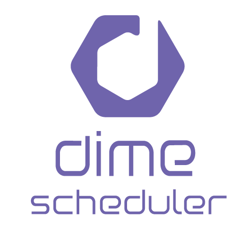

A rolling slide show for Dime.Scheduler.

# Getting started

- Run `yarn` in the root folder to install the package.
- Run `yarn start` to start the presentation. The command line will indicate the port on which the app is hosted. By default this is `http://localhost:8000`.